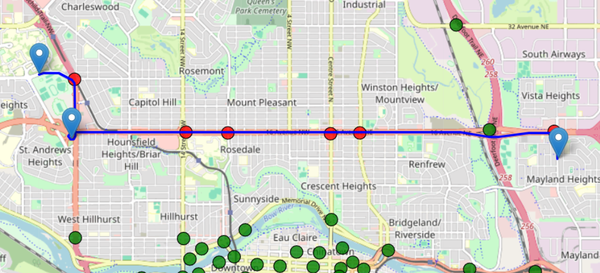
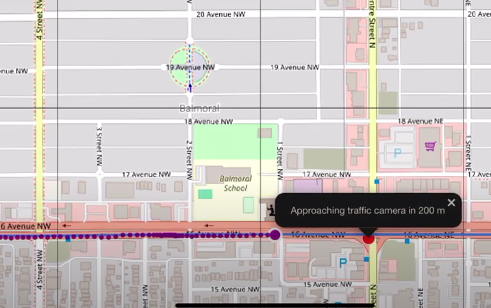
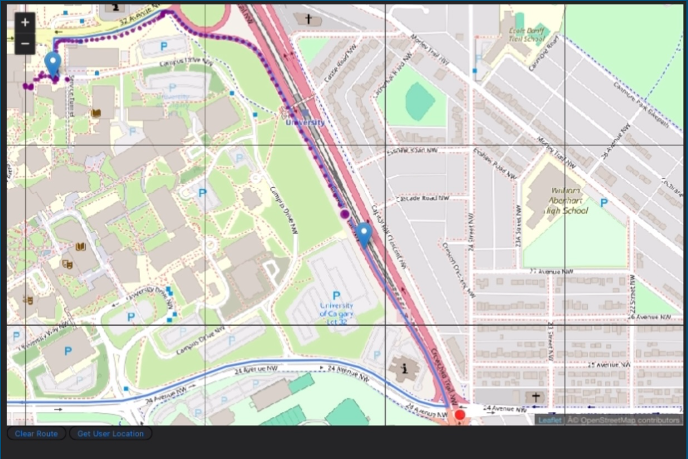

# Traffic Camera Alert App
This app is used to give drivers advanced notice before passing traffic cameras.

## Route Planning
Users can pick a starting point and destination and the app will give the most direct route ans show the cameras that will be passed en route.

## Live Notifications
While the user is driving, they are given alerts when approaching traffic cameras.

## Post Visualization
Users can view the route taken and their relative speed at each point.

